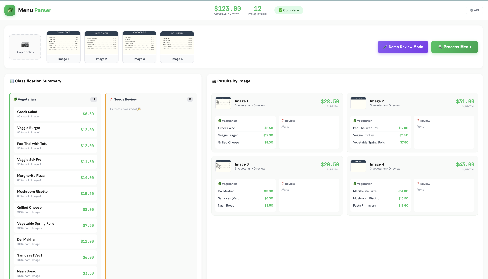
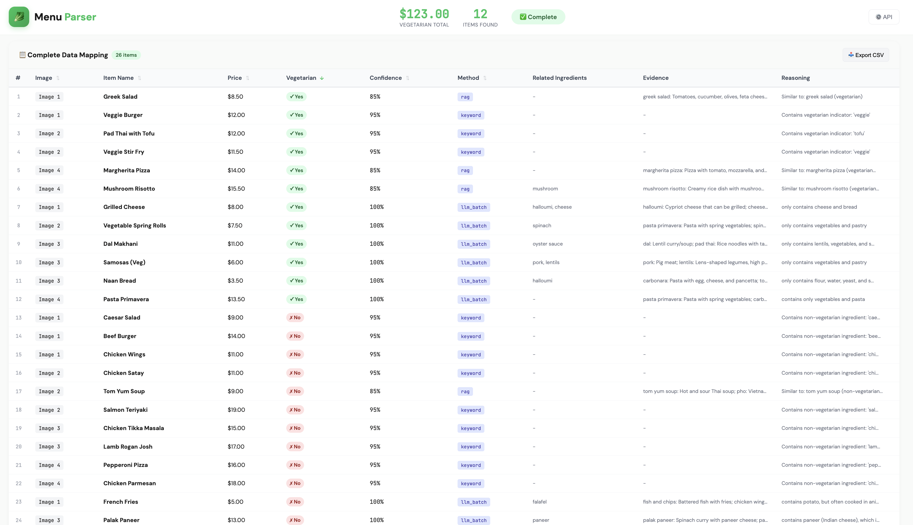
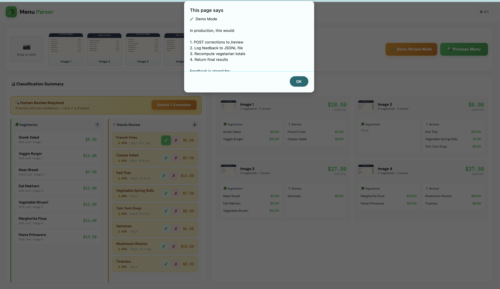
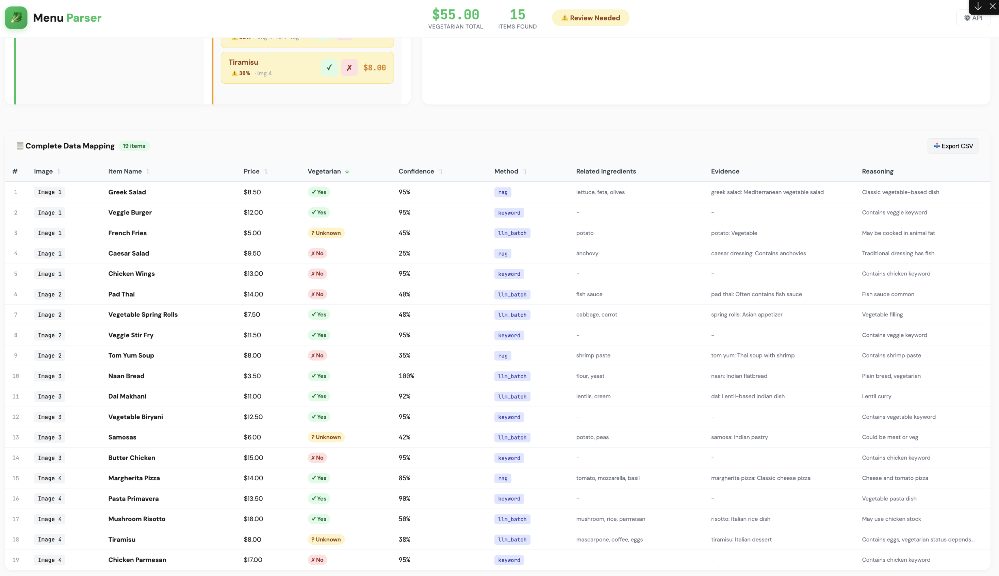

# Menu Parser: Vegetarian Dish Detection System

An AI-powered system that extracts vegetarian dishes from restaurant menu images and calculates their total price.

## Quick Deploy from GitHub

```bash
# Clone the repository
git clone https://github.com/YOUR_USERNAME/menu_parsing.git
cd menu_parsing

# Copy and configure environment
cp env.example .env

# Start Ollama on host (for LLM - uses GPU)
ollama pull llama3.2 && ollama serve

# Launch services
docker-compose up -d

# Test API
curl -X POST http://localhost:8000/process-menu -F "files=@tests/data/menus/american_diner.png"

# Open UI
open ui/index.html
```

## Architecture

```
┌─────────────────────────────────────────────────────────────────────────┐
│                           Client Request                                 │
│                      (1-5 menu images)                                   │
└──────────────────────────────┬──────────────────────────────────────────┘
                               │
                               ▼
┌─────────────────────────────────────────────────────────────────────────┐
│                        REST API Service (:8000)                          │
│  ┌──────────────┐    ┌───────────────┐    ┌────────────────────────┐    │
│  │  OCR Module  │ →  │ Data Parser   │ →  │ MCP Client             │    │
│  │  (Tesseract) │    │ (Regex+LLM)   │    │ (HTTP calls)           │    │
│  └──────────────┘    └───────────────┘    └────────────────────────┘    │
└──────────────────────────────────────────────────┬──────────────────────┘
                                                   │
                              HTTP                 │
                                                   ▼
┌─────────────────────────────────────────────────────────────────────────┐
│                        MCP Server (:8001)                                │
│  ┌────────────────┐   ┌──────────────┐   ┌───────────────────────┐      │
│  │ RAG/Vector DB  │ → │ LLM Classify │ → │ Price Calculator      │      │
│  │ (ChromaDB)     │   │ (Ollama)     │   │                       │      │
│  └────────────────┘   └──────────────┘   └───────────────────────┘      │
└─────────────────────────────────────────────────────────────────────────┘
```

## Features

- **OCR Processing**: Tesseract-based text extraction from menu images
- **Smart Parsing**: Regex patterns with LLM fallback for complex formats
- **Multi-layer Classification**:
  - Keyword matching (fast, high precision)
  - RAG retrieval (semantic similarity against ingredient knowledge base)
  - LLM classification (complex cases)
- **HITL Support**: Human-in-the-loop for uncertain classifications
- **Observability**: Langsmith tracing across all operations

## Quick Start

### Prerequisites

- Docker and Docker Compose
- Ollama (for local LLM) or OpenAI API key
- Tesseract OCR (for local development)

### Install Ollama (Required for LLM)

**macOS:**
```bash
# Using Homebrew
brew install ollama

# Or download from https://ollama.ai/download
```

**Linux:**
```bash
curl -fsSL https://ollama.ai/install.sh | sh
```

**Windows:**
```bash
# Download installer from https://ollama.ai/download
# Or use WSL2 and follow Linux instructions
```

**Pull the model and start:**
```bash
ollama pull llama3.2
ollama serve  # Runs on localhost:11434
```

### Deployment Architecture (macOS / Linux)

Ollama runs on your **host machine** with GPU acceleration, while the API services run in Docker:

```
┌──────────────────────────────────────────────────────────────┐
│  Host Machine (macOS/Linux)                                  │
│                                                              │
│  ┌─────────────────────┐                                     │
│  │ Ollama              │ ← Metal (Mac) / CUDA (Linux)        │
│  │ localhost:11434     │   GPU acceleration                  │
│  └──────────▲──────────┘                                     │
│             │                                                │
│  ───────────┼────────────────────────────────────────────    │
│  Docker     │  (host.docker.internal:11434)                  │
│             │                                                │
│  ┌──────────┴──────────┐      ┌────────────────────────┐     │
│  │ REST API Container  │      │ MCP Server Container   │     │
│  │ Port 8000           │ ──── │ Port 8001              │     │
│  │                     │ HTTP │                        │     │
│  │ • OCR (Tesseract)   │      │ • RAG (ChromaDB)       │     │
│  │ • Menu Parsing      │      │ • LLM Classification   │     │
│  └─────────────────────┘      └────────────────────────┘     │
└──────────────────────────────────────────────────────────────┘
```

This setup ensures:
- **GPU acceleration** for LLM inference (Metal on Mac, CUDA on Linux)
- **No complex GPU passthrough** to Docker containers
- **Easy development** - Ollama manages model downloads and inference

### Running with Docker

1. Clone and configure:
```bash
cp env.example .env
# Edit .env with your settings
```

2. Start Ollama on your host machine (uses GPU):
```bash
ollama pull llama3.2
ollama serve
```

3. Launch Docker services:
```bash
make docker-up
# Or: docker-compose up --build
```

4. Test the API:
```bash
# Using multipart form
curl -X POST http://localhost:8000/process-menu \
  -F "files=@menu.jpg"

# Using base64
curl -X POST http://localhost:8000/process-menu/base64 \
  -H "Content-Type: application/json" \
  -d '{"images": ["<base64-encoded-image>"]}'
```

5. Open the UI:
```bash
# Simply open the HTML file in your browser
open ui/index.html          # macOS
xdg-open ui/index.html      # Linux
start ui/index.html         # Windows
```

The UI provides:
- Drag-and-drop image upload (1-5 images)
- Real-time classification results
- Per-image breakdown with subtotals
- Sortable data table with all extracted items
- CSV export functionality
- Human-in-the-loop review for uncertain items

### Running Locally (Development)

```bash
# Create virtual environment
python -m venv venv
source venv/bin/activate

# Install dependencies
pip install -r requirements.txt

# Install Tesseract OCR
# macOS: brew install tesseract
# Ubuntu: apt-get install tesseract-ocr

# Start MCP Server (terminal 1)
make run-mcp

# Start REST API (terminal 2)
make run-api
```

### Makefile Commands

| Command | Description |
|---------|-------------|
| `make install` | Install Python dependencies |
| `make run-api` | Start REST API on port 8000 |
| `make run-mcp` | Start MCP server on port 8001 |
| `make docker-up` | Build and start Docker containers |
| `make docker-down` | Stop Docker containers |
| `make test` | Run test suite |
| `make generate-menus` | Generate sample menu images |
| `make lint` | Run linter (ruff) |
| `make clean` | Remove cache files |

## API Endpoints

### POST /process-menu
Process menu images via multipart upload.

**Request:**
```
Content-Type: multipart/form-data
files: [image files, 1-5]
```

**Response:**
```json
{
  "request_id": "uuid",
  "vegetarian_items": [
    {"name": "Greek Salad", "price": 8.5, "confidence": 0.95}
  ],
  "total_sum": 8.5,
  "status": "success"
}
```

### POST /process-menu/base64
Process base64-encoded images.

**Request:**
```json
{
  "images": ["base64-string-1", "base64-string-2"]
}
```

### POST /review
Submit human corrections for uncertain items.

**Request:**
```json
{
  "request_id": "uuid-from-needs-review-response",
  "corrections": [
    {"name": "Pad Thai", "is_vegetarian": false}
  ]
}
```

## Configuration

| Variable | Default | Description |
|----------|---------|-------------|
| `LLM_PROVIDER` | ollama | LLM provider (ollama/openai) |
| `OLLAMA_BASE_URL` | http://localhost:11434 | Ollama server URL |
| `OLLAMA_MODEL` | llama3.2 | Ollama model name |
| `OPENAI_API_KEY` | - | OpenAI API key (fallback) |
| `CONFIDENCE_THRESHOLD` | 0.7 | Min confidence for classification |
| `HITL_THRESHOLD` | 0.5 | Below this triggers HITL review |
| `RAG_TOP_K` | 5 | Number of RAG results |
| `LANGCHAIN_API_KEY` | - | Langsmith API key |

### LLM Provider Options

The system supports multiple LLM backends:

**Option 1: Ollama (Default, Recommended)**
```bash
# macOS (Metal GPU) or Linux (CUDA)
ollama pull llama3.2
ollama serve
# Set: LLM_PROVIDER=ollama
```

**Option 2: OpenAI API**
```bash
# No local setup needed, uses cloud API
# Set in .env:
LLM_PROVIDER=openai
OPENAI_API_KEY=sk-your-key-here
OPENAI_MODEL=gpt-4o-mini
```

**Automatic Fallback**: If Ollama is unavailable, the system automatically falls back to OpenAI (if API key is configured).

## Project Structure

```
menu_parsing/
├── configs/
│   └── settings.py              # Pydantic settings
├── src/
│   ├── api/                     # REST API Service
│   │   ├── main.py              # FastAPI entrypoint
│   │   ├── routes/
│   │   │   ├── menu.py          # POST /process-menu
│   │   │   └── review.py        # POST /review (HITL)
│   │   ├── services/
│   │   │   ├── ocr.py           # Tesseract wrapper
│   │   │   ├── parser.py        # Menu text parser
│   │   │   └── mcp_client.py    # MCP HTTP client
│   │   └── schemas/             # Pydantic models
│   └── mcp/                     # MCP Server Service
│       ├── main.py              # FastAPI entrypoint
│       ├── tools/
│       │   ├── classifier.py    # Classification tool
│       │   └── calculator.py    # Price calculation tool
│       ├── rag/
│       │   ├── vectorstore.py   # ChromaDB setup
│       │   ├── embeddings.py    # Sentence transformers
│       │   └── data/
│       │       └── knowledge_base.py
│       └── llm/
│           ├── providers.py     # Ollama/OpenAI providers
│           └── classifier.py    # LLM classification logic
├── tests/
├── scripts/
│   └── generate_test_menus.py   # Test data generator
├── docker/
│   ├── api.Dockerfile
│   └── mcp.Dockerfile
├── docker-compose.yml
└── requirements.txt
```

## Classification Pipeline

1. **Keyword Matching** (confidence ~0.95)
   - Word-boundary matching for vegetarian indicators: `vegetarian`, `veggie`, `vegan`, `plant-based`, `meatless`, `tofu`, `tempeh`, `seitan`, `falafel`, `hummus`
   - Menu markers: `(v)`, `[v]`, `(vg)`, `(vegan)`
   - Meat keywords: `chicken`, `beef`, `pork`, `lamb`, `fish`, `salmon`, `shrimp`, `bacon`, etc.

2. **RAG Retrieval** (confidence ~0.7-0.85)
   - Semantic search against ingredient knowledge base
   - Finds similar ingredients/dishes with known classifications

3. **LLM Classification** (confidence varies)
   - Uses Ollama/OpenAI for complex cases
   - Receives RAG evidence as context

4. **Confidence Combination**
   - Weighted combination of all methods
   - Low confidence triggers HITL review

## Testing

### Unit Tests
```bash
# Generate test menu images first
make generate-menus

# Run unit tests
make test

# Run with coverage report
python -m pytest tests/ --cov=src --cov-report=html
open htmlcov/index.html
```

**Example output:**
```
$ make test
PYTHONPATH=. python3 -m pytest tests/ -v
================================================ test session starts =================================================
platform darwin -- Python 3.9.6, pytest-8.3.4, pluggy-1.6.0
rootdir: /path/to/menu_parsing
configfile: pyproject.toml
plugins: anyio-4.12.1, cov-6.0.0
collected 21 items

tests/test_classifier.py::TestKeywordClassification::test_vegetarian_keyword_positive PASSED   [  4%]
tests/test_classifier.py::TestKeywordClassification::test_meat_keyword_negative PASSED         [  9%]
tests/test_classifier.py::TestKeywordClassification::test_no_keyword_match PASSED              [ 14%]
tests/test_classifier.py::TestCalculator::test_calculate_sum PASSED                            [ 19%]
tests/test_classifier.py::TestCalculator::test_calculate_empty_list PASSED                     [ 23%]
tests/test_classifier.py::TestCalculator::test_calculate_filters_invalid PASSED               [ 28%]
tests/test_integration.py::TestAPIIntegration::test_health_check SKIPPED                       [ 33%]
tests/test_integration.py::TestAPIIntegration::test_root_endpoint SKIPPED                      [ 38%]
tests/test_integration.py::TestAPIIntegration::test_process_menu_base64_mocked SKIPPED         [ 42%]
tests/test_integration.py::TestMCPIntegration::test_mcp_health_check SKIPPED                   [ 47%]
tests/test_integration.py::TestMCPIntegration::test_search_knowledge_base SKIPPED              [ 52%]
tests/test_ocr.py::TestOCRService::test_load_image_from_pil PASSED                             [ 57%]
tests/test_ocr.py::TestOCRService::test_load_image_from_bytes PASSED                           [ 61%]
tests/test_ocr.py::TestOCRService::test_load_image_from_base64 PASSED                          [ 66%]
tests/test_ocr.py::TestOCRService::test_preprocess_converts_to_grayscale PASSED                [ 71%]
tests/test_parser.py::TestMenuParser::test_parse_standard_format PASSED                        [ 76%]
tests/test_parser.py::TestMenuParser::test_parse_multiple_items PASSED                         [ 80%]
tests/test_parser.py::TestMenuParser::test_parse_price_formats PASSED                          [ 85%]
tests/test_parser.py::TestMenuParser::test_parse_empty_text PASSED                             [ 90%]
tests/test_parser.py::TestMenuParser::test_parse_no_prices PASSED                              [ 95%]
tests/test_parser.py::TestMenuParser::test_parse_filters_invalid_prices PASSED                 [100%]

===================================== 16 passed, 5 skipped in 3.72s =====================================
```

> **Note:** Integration tests are skipped when running locally. Use `make docker-test` to run full integration tests against running services.

### System Evaluation (End-to-End)
```bash
# 1. Make sure the system is running
make docker-up-d

# 2. Generate test images (if not done)
make generate-menus

# 3. Evaluate against ground truth
make evaluate
```

**Example output:**
```
$ make evaluate
🔍 Evaluating Menu Parser System
   API URL: http://localhost:8000
   Menus:   4

============================================================
📋 ITALIAN MENU
============================================================

📊 Classification Metrics:
   Precision: 100.0%
   Recall:    75.0%
   F1 Score:  85.7%

💰 Sum Comparison:
   Expected:  $51.00
   Predicted: $43.00
   Accuracy:  84.3%

✅ Correct (3):
   • margherita pizza
   • mushroom risotto
   • pasta primavera

❌ Missed (1):
   • tiramisu
     └─ Reason: Contains eggs - classified as non-vegetarian
     └─ Method: llm, Conf: 0.85
     └─ System classified as NON-vegetarian

... (other menus) ...

============================================================
📈 OVERALL SUMMARY
============================================================

   Average Precision: 100.0%
   Average Recall:    87.5%
   Average F1 Score:  92.9%
   Average Sum Acc:   90.1%

   Total Correct:         14
   Total False Positives: 0
   Total Missed:          2

   Overall Precision: 100.0%
   Overall Recall:    87.5%
   Overall F1 Score:  93.3%

============================================================
🔍 FAILURE ANALYSIS
============================================================

   📍 Italian Menu: tiramisu
      Reason: Contains eggs - classified as non-vegetarian
      Method: llm, Confidence: 0.85

   📍 American Diner: french fries
      Reason: Not found in OCR output
      Method: unknown, Confidence: N/A
```

> **Note:** The failure analysis section helps debug classification errors by showing:
> - **Reason**: Why the system made its decision
> - **Method**: Which classification layer was used (keyword/rag/llm)
> - **Confidence**: How confident the system was

### Ground Truth

Test data in `tests/data/menus/`:
| Menu | Image | Vegetarian Items | Total |
|------|-------|-----------------|-------|
| Italian | `italian_menu.png` | Margherita, Pasta Primavera, Mushroom Risotto, Tiramisu | $51.00 |
| Asian Fusion | `asian_fusion.png` | Spring Rolls, Pad Thai Tofu, Veggie Stir Fry | $31.00 |
| American Diner | `american_diner.png` | Greek Salad, Veggie Burger, French Fries, Grilled Cheese | $33.50 |
| Indian | `indian_cuisine.png` | Palak Paneer, Dal Makhani, Veg Biryani, Samosas, Naan | $46.00 |

**Note:** Ground truth is defined in `tests/data/menus/ground_truth.json`. Some items like Tiramisu and French Fries are debatable - the system may classify them differently based on LLM reasoning.

## Design Decisions

1. **Microservice Split**: Separation of OCR/parsing (API) from classification logic (MCP) enables independent scaling and cleaner boundaries.

2. **Multi-layer Classification**: Keyword matching handles obvious cases quickly, RAG provides semantic understanding, LLM handles edge cases.

3. **Local-first LLM**: Ollama as primary provider ensures open-source compliance and privacy, with OpenAI fallback for reliability.

4. **In-memory Vector Store**: ChromaDB runs embedded for simplicity; production could use persistent/distributed options.

5. **HITL Integration**: Uncertainty acknowledgment rather than forced classification improves real-world accuracy.

## Step-by-Step Workflow

```
1. Generate test data (optional)
   make generate-menus
   
2. Start Ollama (host machine)
   ollama serve
   
3. Start services
   make docker-up
   
4. Open UI
   open ui/index.html
   
5. Upload menu images → Get results!
```

## UI Demo

The web interface provides an intuitive way to upload menu images and view classification results.

### Main Interface
Upload menu images and see results with confidence scores, classification methods, and per-image breakdowns.



### Data Table View
Comprehensive table showing all extracted items with sortable columns, filtering, and CSV export.



### HITL Review Mode
Review uncertain classifications and provide corrections for items below the confidence threshold.



### Review Results Table
After submitting reviews, see the updated results with human corrections applied.



## Detailed Documentation

For in-depth technical details, see **[SYSTEM_BREAKDOWN.md](SYSTEM_BREAKDOWN.md)**:

- **Classification Pipeline**: Keyword → RAG → LLM flow with confidence thresholds
- **Fallback Policies**: What happens when each layer fails
- **HITL Loop**: How human review works and feedback logging
- **Batch Processing**: LLM batching for performance
- **Observability**: Langsmith tracing structure
- **Configuration Options**: All ENV variables explained

## Limitations & Future Work

- OCR accuracy depends on image quality
- Knowledge base is manually curated (expandable)
- Vector store is ephemeral (add persistence for production)
- No multi-language support yet


---

## 👤 Author

**Ara Yeroyan** — AI/ML Engineer

For questions, consulting, or collaboration opportunities — feel free to connect!

<table><tr>
  <td><a href="https://www.linkedin.com/in/ara-yeroyan/"></a></td>
  <td><em>Open for consulting & collaboration</em></td>
</tr></table>

